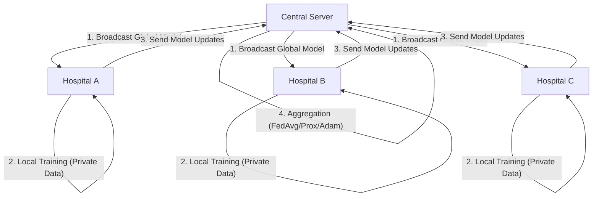

# Federated Learning Simulation Report

## 1. Introduction
This report compares the performance of **FedAvg**, **FedProx**, and **FedAdam** on a healthcare dataset for disease prediction.

## 2. Methodology
- **Model**: Simple MLP (3 Layers)
- **Clients**: 5
- **Rounds**: 20
- **Dataset**: Synthetic Patient Health Monitoring

## 3. Results Comparison

| Algorithm | Final Accuracy | Final Loss | Converged In (approx) |
|-----------|----------------|------------|-----------------------|
| FedAvg | 94.14% | 0.1473 | N/A |
| FedProx | 93.81% | 0.1591 | N/A |
| FedAdam | 92.50% | 0.2044 | N/A |

## 4. Visualizations

### FL Architecture Diagram

### Accuracy Comparison

### Loss Comparison

## 5. Importance of Research in Healthcare
Federated Learning is pivotal for healthcare for several reasons:
1. **Privacy Preservation**: Patient data remains on local devices/hospitals, complying with HIPAA/GDPR.
2. **Data Silos**: Unlocks insights from fragmented data sources without centralization.
3. **Bandwidth Efficiency**: Only model weights are transferred, not large datasets.
4. **Real-time Personalization**: Local models can be fine-tuned for specific hospital demographics while benefiting from global intelligence.
